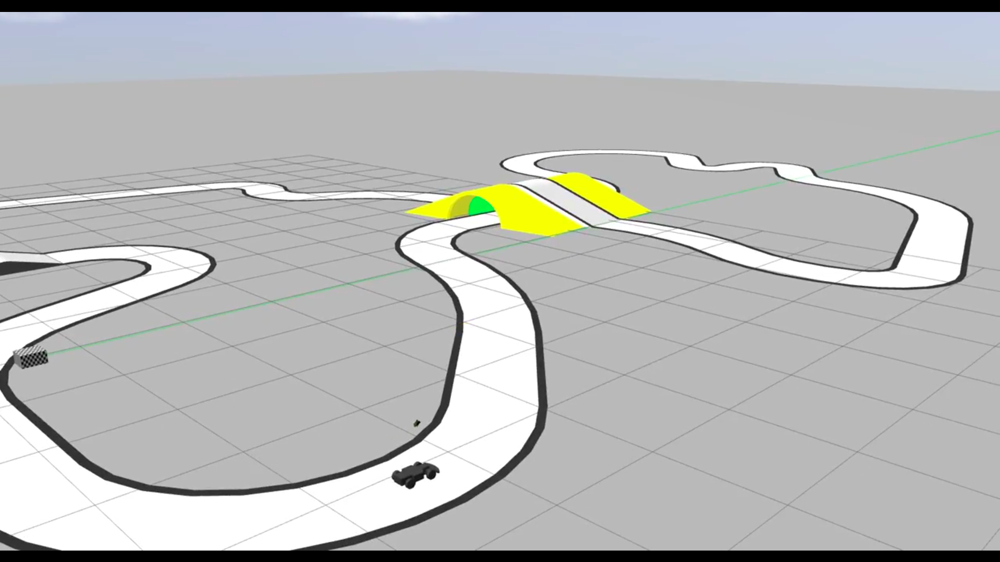

# ROS2-Autonomous Car

## Overview
This project involves the development of a reliable autonomous navigation system using ROS2 and Pixy Cam. The primary goal is to ensure the car remains within track boundaries while adapting to dynamic scenarios. My main role was in modifying the python script and implementing a PID controller in such a way that the car never goes off the track.

## Features
- **Autonomous Navigation**: Implements Python-based control for navigating within boundaries.
- **Enhanced Reliability**: Modified algorithms for robust performance in ROS2 environments.

## Technologies Used
- **Languages**: Python
- **Frameworks/Tools**: ROS2, Pixy Cam

## Setup Instructions
1. Clone the repository: `git clone https://github.com/Devam-032/ros2_auto`
2. Run the script: `python3 aim_line_follow.py`

## Documentation
Refer to the [documentation](https://drive.google.com/file/d/1xRJxbgFtd2BRwG8qlNg3kLUpPUzyKVGV/view?usp=sharing) for setup, configuration, and usage guidelines.

## Contributing
Contributions are welcome! Please read the [contributing guidelines](link_to_contributing.md) for more information.
